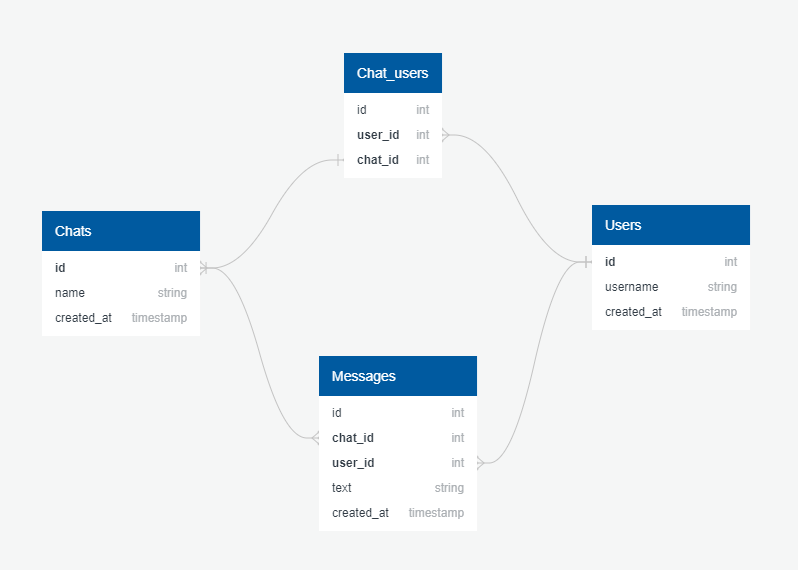

# http api chat

## Main entities

### User

* **id**
* **username**
* **created_at**

### Chat

* **id**
* **name**
* **users**
* **created_at**

### Message

* **id**
* **chat**
* **author**
* **text**
* **created_at**

## Main api methods

### Add new user

```
curl --header "Content-Type: application/json" \
  --request POST \
  --data '{"username": "user_1"}' \
  http://localhost:9000/users/add
```

### Create new chat between users

```
curl --header "Content-Type: application/json" \
  --request POST \
  --data '{"name": "chat_1", "users": ["<USER_ID_1>", "<USER_ID_2>"]}' \
  http://localhost:9000/chats/add
```

### Send message into chat

```
curl --header "Content-Type: application/json" \
  --request POST \
  --data '{"chat": "<CHAT_ID>", "author": "<USER_ID>", "text": "hi"}' \
  http://localhost:9000/messages/add
```

### Get list of user chats

```
curl --header "Content-Type: application/json" \
  --request POST \
  --data '{"user": "<USER_ID>"}' \
  http://localhost:9000/chats/get
```

### Get list of messages in chat

```
curl --header "Content-Type: application/json" \
  --request POST \
  --data '{"chat": "<CHAT_ID>"}' \
  http://localhost:9000/messages/get
```


## DB Schema


